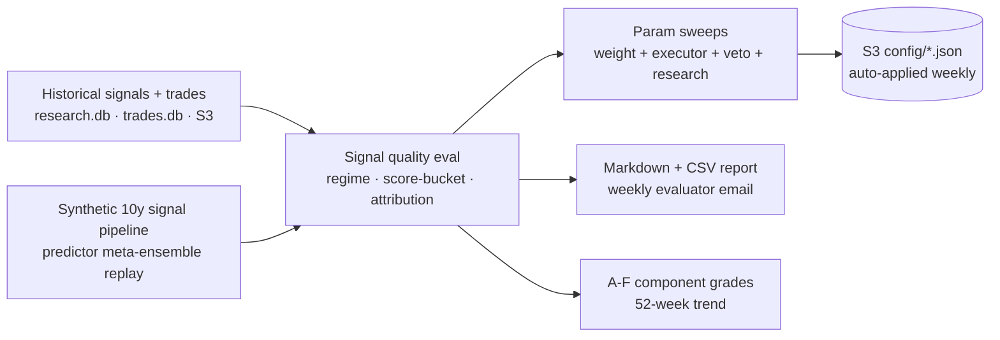

# alpha-engine-backtester

> Part of [**Nous Ergon**](https://nousergon.ai) — a harness for rigorous AI/ML experiments in finance: an equity research-and-trading system instrumented end-to-end. Repo and S3 names use the underlying project name `alpha-engine`.

Weekly system evaluator and autonomous parameter optimizer. Reads historical signals + trades, measures signal quality, runs parameter sweeps, and writes four optimized configs back to S3 each week — closing the system's learning loop without manual intervention.

> System overview, Step Function orchestration, and module relationships live in [`alpha-engine-docs`](https://github.com/nousergon/nousergon-docs). Code index lives in [`OVERVIEW.md`](OVERVIEW.md).

## What this does

- **Signal quality evaluation** — accuracy at 10d/30d, regime-conditional breakdowns, score-bucket analysis, sub-score attribution from `score_performance` table
- **Autonomous config auto-apply** — writes four configs back to S3 each week: `scoring_weights.json` (Research), `executor_params.json` (Executor 60-trial random search over 6 risk params, ranked by Sharpe), `predictor_params.json` (veto threshold auto-tune), `research_params.json` (deferred until 200+ samples)
- **Predictor synthetic backtest** — replays 10y of synthetic signals through the meta-ensemble on the full S3 price cache; primary param-sweep substrate
- **VectorBT portfolio simulation** — replays historical orders to produce Sharpe / drawdown / Calmar / alpha tracking
- **Component grading** — A–F scorecard across all system components rolled into a 52-week trend, used for the weekly evaluator email
- **LLM-as-judge eval** (consolidated 2026-04-24) — judge rubric scoring runs inside the same spot job as backtest + parity

## Phase 2 measurement contribution

This is the system's learning mechanism. Phase 2 contribution: every week the backtester captures whether the prior week's signals + parameter set produced expected outcomes, then writes the optimized parameter set forward. The weekly cadence + auto-apply discipline is the substrate that lets Phase 3 systematically tune toward sustained alpha — without it, parameter changes would require manual deployment and the feedback loop would close in months instead of weeks.

## Architecture

Runs weekly after Predictor Training on a c5.large EC2 spot instance (~$0.01/week). Spot instance now runs backtest + parity + evaluator + LLM-as-judge atomically — consolidated from 8 dedicated SF states into one job (2026-04-24).

## Configuration

This repo is **public**. Optimizer guardrails, sweep bounds, and config-promotion thresholds live in the private [`alpha-engine-config`](https://github.com/nousergon/alpha-engine-config) repo. Architecture and approach are public; specific values are private.

## Sister repos

| Module | Repo |
|---|---|
| Executor | [`alpha-engine`](https://github.com/nousergon/crucible-executor) |
| Data | [`alpha-engine-data`](https://github.com/nousergon/nousergon-data) |
| Research | [`alpha-engine-research`](https://github.com/nousergon/crucible-research) |
| Predictor | [`alpha-engine-predictor`](https://github.com/nousergon/crucible-predictor) |
| Dashboard | [`alpha-engine-dashboard`](https://github.com/nousergon/crucible-dashboard) |
| Library | [`alpha-engine-lib`](https://github.com/nousergon/nousergon-lib) |
| Docs | [`alpha-engine-docs`](https://github.com/nousergon/nousergon-docs) |

## License

AGPL-3.0-only — see [LICENSE](LICENSE). Commercial licenses available — contact brian@nousergon.ai.
